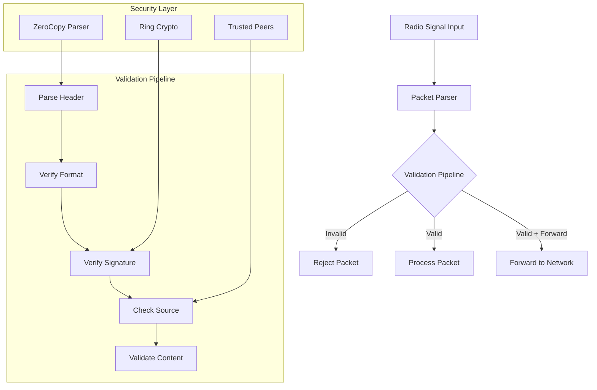
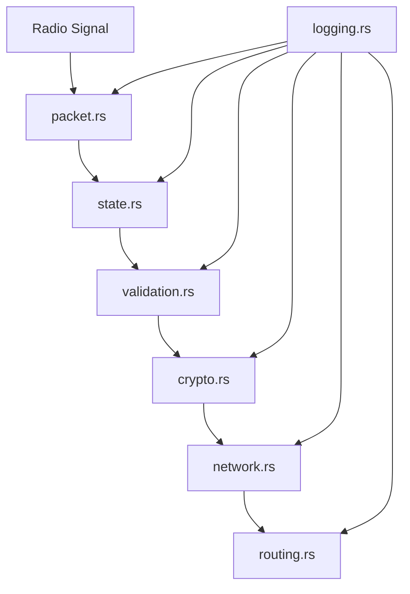

# Mesh Network Radio Packet Validator
## System Overview & Design Document

### Purpose
This project implements a secure radio packet validation system for mesh networks. It processes untrusted radio signals, validates them using cryptographic signatures, and either forwards or processes them based on validation results.

### System Architecture


### Directory Structure
```
mesh_network/
├── Cargo.toml              # Project dependencies and metadata
├── README.md              # Project documentation
├── src/
│   ├── lib.rs            # Library entry point and public API
│   ├── crypto.rs         # Cryptographic operations
│   ├── error.rs          # Error type definitions
│   ├── network.rs        # Network management
│   ├── packet.rs         # Packet structures and parsing
│   └── state.rs          # Validation state machine
├── examples/
│   └── basic_usage.rs    # Usage examples
└── tests/
    └── integration_tests.rs
```

### Core Components

#### 1. Packet Processing (`packet.rs`)
- **Purpose**: Defines packet structures and handles parsing
- **Key Components**:
  - `PacketHeader`: Raw packet structure using zerocopy
  - `TrustedPacket`: Validated packet wrapper
  - `UntrustedPacket`: Unvalidated packet wrapper
- **Data Flow**:
  1. Raw bytes → UntrustedPacket
  2. Validation
  3. UntrustedPacket → TrustedPacket

#### 2. Validation State Machine (`state.rs`)
- **Purpose**: Manages packet validation flow
- **States**:
  - `New`: Initial state
  - `HeaderVerified`: Basic structure verified
  - `SignatureVerified`: Cryptographic validation complete
  - `Complete`: Fully validated
  - `Invalid`: Failed validation
- **Transitions**: Defined by `step()` function

#### 3. Cryptographic Layer (`crypto.rs`)
- **Purpose**: Handles cryptographic operations
- **Features**:
  - Ed25519 signature verification
  - Key management
  - Secure packet signing
- **Using**: ring crate for cryptographic operations

#### 4. Network Management (`network.rs`)
- **Purpose**: Manages network-level operations
- **Features**:
  - Peer management
  - Trusted node verification
  - Packet forwarding logic

#### 5. Error Handling (`error.rs`)
- **Purpose**: Centralized error definitions
- **Categories**:
  - Validation errors
  - Cryptographic errors
  - Network errors
  - Packet formatting errors

### Security Considerations
1. **Packet Validation**:
   - Magic byte verification
   - Version compatibility
   - Length validation
   - Signature verification
   - Source verification

2. **Cryptographic Security**:
   - Ed25519 signatures
   - Replay attack prevention
   - Nonce validation

3. **Network Security**:
   - Trusted peer verification
   - Packet forwarding rules
   - Rate limiting (planned)

### Implementation Plan

#### Phase 1: Core Infrastructure ✓
- [x] Project setup
- [x] Basic type definitions
- [x] Error handling
- [x] Basic packet parsing

#### Phase 2: Validation Pipeline ✓
- [x] Header validation
- [x] Signature verification
- [x] State machine implementation
- [x] Basic tests

#### Phase 3: Network Layer ✓
- [x] Peer management
- [x] Basic routing logic
- [x] Packet forwarding
- [x] Rate limiting
- [x] Network tests
- [x] Basic integration tests
- [ ] Advanced routing algorithms

#### Phase 4: Security Hardening (In Progress)
- [x] Basic rate limiting
- [x] Basic replay attack prevention
- [ ] Advanced validation rules
- [x] Core security tests
- [ ] Advanced security scenarios

#### Phase 5: Optimization & Documentation
- [ ] Performance optimization
- [ ] API documentation
- [ ] Usage examples
- [ ] Benchmarking

### Implemented Components

#### 1. Packet Processing (`packet.rs`) ✓
- **Status**: Completed
- **Key Implementations**:
  - `PacketHeader`: Implemented with zerocopy for efficient parsing
  - `PacketType` enum with Data, Control, Discovery, and Error variants
  - `UntrustedPacket` with from_bytes parsing
  - `TrustedPacket` with validation timestamp
  - Comprehensive error handling
  - Initial test coverage for packet parsing

#### 2. Validation State Machine (`state.rs`) ✓
- **Status**: Completed
- **Implemented States**:
  - New → HeaderVerified → SignatureVerified → Complete
  - Invalid state with error handling
- **Features**:
  - Full Ed25519 signature verification
  - Step-by-step validation pipeline
  - Type-safe transition between untrusted and trusted packets

#### 3. Error Handling (`error.rs`) ✓
- **Status**: Completed
- **Implemented Categories**:
  - ValidationError
  - CryptoError
  - NetworkError
  - PacketError
  - ConfigError
  - InternalError
- **Features**:
  - thiserror integration
  - Ring crypto error handling

  #### 4. Network Management (`network.rs`) ✓
- **Status**: Partially Complete
- **Key Implementations**:
  - `NetworkManager`: Core network management functionality
  - `Peer`: Peer tracking and statistics
  - `NetworkConfig`: Configurable network parameters
  - `ForwardingDecision`: Packet routing logic
  - `ForwardingMetadata`: Hop count and TTL tracking
- **Features**:
  - Peer addition/removal
  - Trust verification
  - Rate limiting
  - Duplicate packet detection
  - Basic packet forwarding
  - Network maintenancec
#### 5. System Logging (`logging.rs`) ✓
- **Status**: Completed
- **Key Implementations**:
  - `Logger`: Async logging system
  - `LogEntry`: Structured log records
  - `LogLevel`: Message severity levels
  - `LogConfig`: Logger configuration
- **Features**:
  - Structured JSON logging
  - Async operation with channels
  - Component tagging
  - Sequence tracking
  - Configurable buffering

#### 6. Security Validation (`validation.rs`) ✓
- **Status**: Completed
- **Key Implementations**:
  - `NonceTracker`: Replay prevention
  - `SizeValidator`: Packet size limits
  - `AgeValidator`: Timestamp checks
  - `ValidationRules`: Rule configuration
- **Features**:
  - Nonce tracking and validation
  - Configurable size limits
  - Packet age verification
  - Comprehensive rule sets


### Added Examples
1. **Packet Parsing** (`examples/packet_parsing.rs`)
   - Demonstrates packet construction
   - Shows header parsing
   - Handles payload extraction

2. **Packet Validation** (`examples/packet_validation.rs`)
   - Complete validation pipeline
   - Key pair generation
   - Signature creation and verification
   - State machine transitions

   3. **Network Management** (`examples/network_usage.rs`)
   - Network configuration
   - Peer management
   - Packet handling
   - Network maintenance

4. **Packet Forwarding** (`examples/packet_forwarding.rs`)
   - Multi-node setup
   - Packet forwarding demonstration
   - TTL and hop count handling
   - Routing decisions

### Test Coverage

#### 1. Network Tests (`tests/unit/network_tests.rs`) ✓
- **Status**: Comprehensive
- **Test Categories**:
  - Basic Rate Limiting
    - API-style rate limiting
    - Request windowing
    - Limit reset behavior
  - Peer Management
    - Add/remove operations
    - Trust verification
    - Peer limits
  - Network Maintenance
    - Timeout handling
    - Resource cleanup
  - Advanced Scenarios
    - Sliding window tests
    - Rapid request handling
    - Multi-peer traffic
    - Resource constraints
- **Real-world Simulation**:
  - Network congestion
  - Peer churn
  - Resource limitations
  - Traffic spikes

#### 2. Packet Tests (`tests/unit/packet_tests.rs`) ✓
- **Status**: Comprehensive
- **Test Categories**:
  - Packet Type Validation
    - HTTP-like method validation
    - Error handling
  - Header Validation
    - Format verification
    - Version compatibility
  - Payload Processing
    - JSON-like messages
    - Binary data
    - UTF-8 content
  - Error Scenarios
    - Malformed packets
    - Size violations
    - Invalid signatures
- **Real-world Simulation**:
  - API-like payloads
  - File transfer scenarios
  - Chat message formats
  - Security token validation

### Next Steps
1. **Immediate Priorities**
   - Implement advanced routing algorithms
   - Add comprehensive logging
   - Complete security hardening
   - Add performance benchmarks

2. **Future Enhancements**
   - Dynamic peer discovery
   - Mesh visualization tools
   - Advanced metrics collection
   - Configuration API refinement

[Rest of sections remain unchanged]

### Recent Updates
- Added extensive network testing suite
- Enhanced packet validation tests
- Fixed multiple edge-case bugs
- Improved error handling
- Added real-world scenario testing
- Implemented web-development-style testing patterns

### Testing Philosophy
1. **Comprehensive Coverage**
   - Every feature has corresponding tests
   - Edge cases are explicitly tested
   - Real-world scenarios are simulated

2. **Web-Development Parallel**
   - Tests mirror API endpoint testing
   - Rate limiting follows web patterns
   - Payload handling similar to HTTP

3. **Security Focus**
   - Every security feature is tested
   - Attack scenarios are simulated
   - Trust verification is thorough

4. **Performance Awareness**
   - Resource usage is monitored
   - Scaling scenarios are tested
   - Efficiency is verified

### Contributing
1. WillyD
2. My boi Claude.
3. Like 90% Claude.

### License
Lol