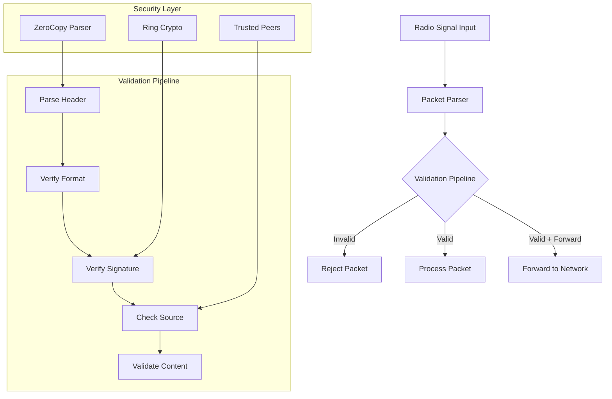

# Mesh Network Radio Packet Validator
## System Overview & Design Document

### Purpose
This project implements a secure radio packet validation system for mesh networks. It processes untrusted radio signals, validates them using cryptographic signatures, and either forwards or processes them based on validation results.

### System Architecture


### Directory Structure
```
mesh_network/
├── Cargo.toml              # Project dependencies and metadata
├── README.md              # Project documentation
├── src/
│   ├── lib.rs            # Library entry point and public API
│   ├── crypto.rs         # Cryptographic operations
│   ├── error.rs          # Error type definitions
│   ├── network.rs        # Network management
│   ├── packet.rs         # Packet structures and parsing
│   └── state.rs          # Validation state machine
├── examples/
│   └── basic_usage.rs    # Usage examples
└── tests/
    └── integration_tests.rs
```

### Core Components

#### 1. Packet Processing (`packet.rs`)
- **Purpose**: Defines packet structures and handles parsing
- **Key Components**:
  - `PacketHeader`: Raw packet structure using zerocopy
  - `TrustedPacket`: Validated packet wrapper
  - `UntrustedPacket`: Unvalidated packet wrapper
- **Data Flow**:
  1. Raw bytes → UntrustedPacket
  2. Validation
  3. UntrustedPacket → TrustedPacket

#### 2. Validation State Machine (`state.rs`)
- **Purpose**: Manages packet validation flow
- **States**:
  - `New`: Initial state
  - `HeaderVerified`: Basic structure verified
  - `SignatureVerified`: Cryptographic validation complete
  - `Complete`: Fully validated
  - `Invalid`: Failed validation
- **Transitions**: Defined by `step()` function

#### 3. Cryptographic Layer (`crypto.rs`)
- **Purpose**: Handles cryptographic operations
- **Features**:
  - Ed25519 signature verification
  - Key management
  - Secure packet signing
- **Using**: ring crate for cryptographic operations

#### 4. Network Management (`network.rs`)
- **Purpose**: Manages network-level operations
- **Features**:
  - Peer management
  - Trusted node verification
  - Packet forwarding logic

#### 5. Error Handling (`error.rs`)
- **Purpose**: Centralized error definitions
- **Categories**:
  - Validation errors
  - Cryptographic errors
  - Network errors
  - Packet formatting errors

### Security Considerations
1. **Packet Validation**:
   - Magic byte verification
   - Version compatibility
   - Length validation
   - Signature verification
   - Source verification

2. **Cryptographic Security**:
   - Ed25519 signatures
   - Replay attack prevention
   - Nonce validation

3. **Network Security**:
   - Trusted peer verification
   - Packet forwarding rules
   - Rate limiting (planned)

### Implementation Plan

#### Phase 1: Core Infrastructure
- [x] Project setup
- [x] Basic type definitions
- [ ] Error handling
- [ ] Basic packet parsing

#### Phase 2: Validation Pipeline
- [ ] Header validation
- [ ] Signature verification
- [ ] State machine implementation
- [ ] Basic tests

#### Phase 3: Network Layer
- [ ] Peer management
- [ ] Packet forwarding
- [ ] Network tests
- [ ] Integration tests

#### Phase 4: Security Hardening
- [ ] Rate limiting
- [ ] Replay attack prevention
- [ ] Advanced validation rules
- [ ] Security tests

#### Phase 5: Optimization & Documentation
- [ ] Performance optimization
- [ ] API documentation
- [ ] Usage examples
- [ ] Benchmarking

### Usage Example
```rust
use mesh_network::{MeshNetwork, MeshConfig};

fn main() -> Result<(), Box<dyn std::error::Error>> {
    // Initialize with default config
    let mesh = MeshNetwork::new(MeshConfig::default());
    
    // Process incoming radio packet
    let result = mesh.process_packet(&radio_data)?;
    
    match result {
        Some(trusted_packet) => {
            // Handle validated packet
        },
        None => {
            // Handle invalid packet
        }
    }
    
    Ok(())
}
```

### Performance Considerations
1. Zero-copy parsing for efficient memory usage
2. State machine design for clear validation flow
3. Minimal allocations during packet processing
4. Efficient cryptographic operations

### Future Enhancements
1. Advanced packet routing
2. Dynamic peer discovery
3. Mesh network visualization
4. Performance metrics
5. Configuration API
6. Logging system

### Development Guidelines
1. All public APIs must be documented
2. Tests required for new features
3. Error handling must be comprehensive
4. Security considerations must be reviewed
5. Performance impact must be considered

### Contributing
1. WillyD
2. My boi Claude.

### License
Lol