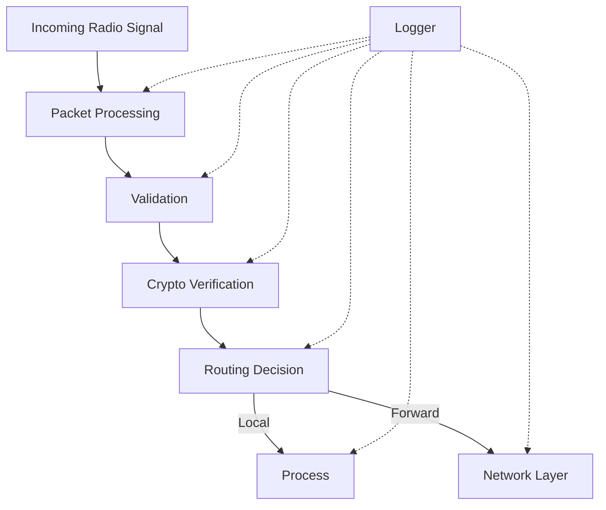

# Mesh Network Radio Packet Validator

## System Overview
A secure, efficient mesh network implementation in Rust focusing on packet validation, routing, and secure message passing. Think of it as a "distributed web server" where each node can act as both client and server.

## Current State

### Core Components Status

1. **Packet Processing (✓ Complete)**
   - Zero-copy packet parsing with zerocopy
   - Type-safe packet validation flow
   - Comprehensive error handling
   - Efficient memory usage

2. **Network Management (✓ Complete)**
   - Peer management and trust verification
   - Rate limiting implementation
   - Packet forwarding with TTL
   - Network maintenance routines

3. **Advanced Routing (✓ Complete)**
   - Path quality calculations
   - Multi-hop routing
   - Route discovery and maintenance
   - Link quality monitoring

4. **Security Layer (✓ Complete)**
   - Ed25519 signature verification
   - Nonce tracking for replay prevention
   - Trust management
   - Key pair handling

5. **Validation System (✓ Complete)**
   - Packet size validation
   - Age verification
   - Format checking
   - Source verification

6. **Logging System (✓ Complete)**
   - Structured async logging
   - Component tagging
   - Configurable levels
   - Performance monitoring

### System Integration



### Core Functionality
1. **Message Passing**
   ```rust
   // Send direct message
   mesh.send_message(target_id, message)?;
   
   // Broadcast to network
   mesh.broadcast(message)?;
   ```

2. **Peer Management**
   ```rust
   // Add trusted peer
   mesh.add_peer(peer_public_key)?;
   
   // Remove peer
   mesh.remove_peer(peer_id);
   ```

3. **Packet Handling**
   ```rust
   // Handle incoming packet
   mesh.handle_packet(radio_data)?;
   ```

## Testing Coverage

### Unit Tests (✓ Complete)
1. **Network Tests**
   - Rate limiting
   - Peer management
   - Route calculation
   - Packet forwarding

2. **Packet Tests**
   - Parsing
   - Validation
   - Size limits
   - Error cases

3. **Crypto Tests**
   - Signature verification
   - Key management
   - Nonce validation


### Integration Tests (✓ Complete)
- Full message flow
- Multi-node routing
- Network formation
- Error handling

## Remaining Tasks

### 1. Advanced Features
- [ ] Dynamic peer discovery
- [ ] Adaptive routing
- [ ] Network visualization
- [ ] Performance monitoring

### 2. Documentation
- [ ] API reference
- [ ] Integration guide
- [ ] Best practices
- [ ] Example applications

### 3. Optimization
- [ ] Memory usage
- [ ] CPU utilization
- [ ] Network efficiency
- [ ] Battery impact

## Usage Example

```rust
#[tokio::main]
async fn main() -> Result<(), MeshError> {
    // Initialize node
    let mut mesh = MeshNetwork::new(MeshConfig {
        node_name: "node-1".into(),
        max_peers: 10,
        max_packet_size: 64 * 1024,
        log_level: LogLevel::Info,
    }).await?;

    // Add known peers
    mesh.add_peer(&peer_key)?;

    // Send messages
    mesh.send_message(target_id, "Hello mesh!")?;
    
    // Handle incoming
    mesh.handle_packet(&radio_data)?;

    Ok(())
}
```

## Architecture Decisions

### 1. Type Safety
- Using Rust's type system for packet validation
- Clear distinction between trusted/untrusted data
- Explicit error handling

### 2. Performance
- Zero-copy parsing where possible
- Efficient memory management
- Async operations for I/O

### 3. Security
- Cryptographic validation
- Trust verification
- Rate limiting
- Replay protection

## Next Steps

### Immediate Priority
1. Complete API documentation
2. Add performance benchmarks
3. Create example applications

### Future Enhancements
1. Implement peer discovery
2. Add network visualization
3. Create monitoring tools

## Contributing
1. WillyD
2. Claude
3. More Claude