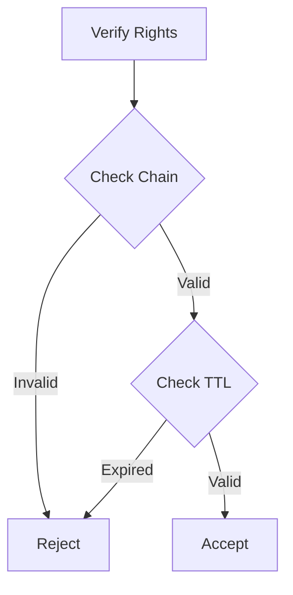

# Mesh Network Implementation

## Core Concept
A minimal, secure mesh network focusing on packet routing and cryptographic validation. Implements layers 2 & 3 of the OSI model with support for arbitrary layer 4 protocols.

## New File Structure
```
src/
├── lib.rs           # Core Network implementation
├── packet.rs        # Packet and path vector handling
├── auth.rs          # Authorization tree (replacing crypto.rs)
└── error.rs         # Error handling
```


# Key Adjustments Needed

## 1. Generic Transmitter
Our documentation doesn't properly emphasize the `Tx` generic parameter:
```rust
// This is more fundamental than we showed
pub struct Network {
    transmitter: Tx,  // Abstract byte transmitter
    // ... other fields
}
```
- Must be a mutable reference to byte transmitter
- This is the core interface for network communication

## 2. CRDT-Style Route Updates
We need to explicitly document how route updates work:
- Similar to CRDT Map implementations
- With added cryptographic validation
- Need to define conflict resolution strategy

## 3. Authorization Model Clarification
Current documentation oversimplifies the authorization tree:
```rust
pub struct AuthTree {
    rights: Rights,
    ttl: Duration,
    children: Vec,
    signatures: Vec,
}
```
Key points missing:
- Any keypair can sign child nodes
- Rights are inherited and time-limited
- Rights delegation for routing capabilities

## 4. Routing Simplification
Need to better distinguish between:
- Routing nodes (full path vector)
- Non-routing nodes (just next hop)
- Path truncation at each hop


## Revised Core Requirements

### Network<Tx>
```rust
impl Network {
    // Core function - more important than we initially showed
    fn accept(bytes: [u8]) -> Option;
    
    // Supporting functions
    fn verify_auth_chain(&self, chain: &[Signature]) -> bool;
    fn update_routes(&mut self, update: RouteUpdate) -> Result;
}
```

### Authorization
- Remove complex crypto operations
- Focus on signature chain verification
- Rights delegation with TTL
- Routing rights management

### Routing
- Simplify to path vectors
- Remove complex route computation
- Focus on path truncation
- Keep track of only necessary information

### Packet Structure
```rust
struct Packet {
    source: PublicKey,
    destination: PublicKey,
    path: PathVector,
    content: Vec,
    auth_chain: Vec,
}
```

## Key Changes from Previous Plan

### Remove
- Complex route table structures
- Separate crypto module
- Network management functions
- Complex error handling

### Add
- CRDT-style route updates
- Proper generic transmitter handling
- Simplified authorization tree
- Clear node type distinction

### Modify
- Simplify routing to just path vectors
- Focus on auth chain verification
- Reduce to essential components only

## MVP Implementation Order
1. Basic Network<Tx> with accept()
2. Simple packet validation
3. Path vector basics
4. Authorization chains
5. Route updates (CRDT-style)


## Component Specifications

### 1. lib.rs - Core Network Implementation
**Purpose**: Provide generic network interface with abstract transmitter

**Core Types**:
```rust
trait Transmitter { ... }
pub struct Network<Tx: Transmitter> {
    transmitter: Tx,            // Abstract byte transmitter
    keypair: Ed25519KeyPair,    // Node keypair
    network_key: PublicKey,     // Network public key
    routes: Option<RouteTable>, // Optional for non-routing nodes
}
```

**Key Functions**:
- `Network::new(transmitter: Tx, keypair: KeyPair, network_key: PublicKey) -> Self`
- `Network::accept(&mut self, bytes: [u8]) -> Option<TrustedPacket>`
- `Network::send(&mut self, dest: PublicKey, content: &[u8]) -> Result<(), Error>`
- `Network::update_routes(&mut self, update: RouteUpdate) -> Result<(), Error>`

**Responsibilities**:
- Abstract transmitter management
- Packet acceptance and validation
- Basic routing decisions
- Authorization verification

### 2. packet.rs - Packet and Path Vector
**Purpose**: Handle packet structure and path vectors

**Core Types**:
```rust
pub struct Packet {
    destination: PublicKey,
    content: PacketBody,
    sig: Signature, // packet source is the public key of the signature
}

pub enum PacketBody {
    Forward(Packet),
    Content([u8]),
}
```

**Key Functions**:
- `from_bytes(data: &[u8]) -> Result<Self, Error>`
- `to_bytes(&self) -> Vec<u8>`
- `truncate_path(&mut self)`
- `verify_path(&self, network_key: &PublicKey) -> bool`

**Responsibilities**:
- Zero-copy parsing
- Path vector handling
- Basic validation
- Serialization

### 3. auth.rs - Authorization Tree
**Purpose**: Manage authorization chains and rights delegation

**Core Types**:
```rust
pub struct AuthTree {
    keypair: PublicKey,
    rights: Rights,
    ttl: Duration,
    delegations: Vec<Delegation>,
}

pub struct Rights {
    can_route: bool,
    can_delegate: bool,
    expires_at: SystemTime,
}
```

**Key Functions**:
- `verify_chain(chain: &[Signature], required_rights: Rights) -> bool`
- `delegate_rights(to: PublicKey, rights: Rights, ttl: Duration) -> Signature`
- `verify_routing_rights(chain: &[Signature]) -> bool`

**Responsibilities**:
- Rights management
- Authorization chains
- TTL tracking
- Delegation verification

### 4. error.rs - Error Types
**Purpose**: Define core error types

**Core Types**:
```rust
pub enum Error {
    InvalidPacket(String),
    InvalidAuth(String),
    RoutingError(String),
    TransmitError(String),
}
```

**Responsibilities**:
- Error definitions
- Result type aliases
- Error context

## Core Workflows

### 1. Packet Processing
```mermaid
graph TD
    A[accept(bytes)] --> B[Parse Packet]
    B --> C{Validate Auth}
    C -->|Invalid| D[None]
    C -->|Valid| E{Routing Node?}
    E -->|Yes| F[Process Path]
    E -->|No| G[Check Next Hop]
    F --> H[Forward/Process]
    G --> H
```

### 2. Authorization
